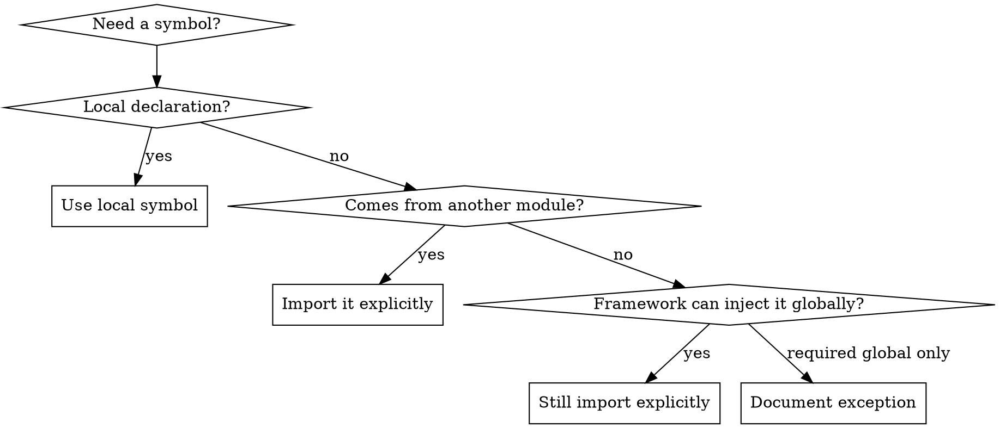

# Using Explicit Imports

## Overview

Prefer explicit imports for every non-local dependency. Make each file declare where its symbols come from so dependency edges stay searchable, reviewable, and analyzable.

## Core Rules

- Import every external symbol explicitly in the file that uses it.
- Prefer normal module exports over framework-global injection, auto-import, prototype patching, or magic template helpers.
- In Vue SFCs, import helpers in `<script setup>` and reference them from the template.
- Rename imports or exports when needed to keep roles clear, such as `i18nPlugin` for the Vue plugin and `i18n` for the translation helper.
- Pause only when a framework or third-party integration truly requires global registration, then document why the implicit edge is unavoidable.

## Decision Guide



## Preferred Patterns

### Vue template helpers

Bad:

```vue
<template>
  <label>{{ $t('语言切换-标签') }}</label>
</template>
```

Good:

```vue
<script setup lang="ts">
import { i18n } from '../i18n'
</script>

<template>
  <label>{{ i18n`语言切换-标签` }}</label>
</template>
```

### Plugin wiring

Bad:

```ts
export const i18n = createI18n({
  globalInjection: true,
})
```

Good:

```ts
export const i18nPlugin = createI18n({
  globalInjection: false,
})

export function i18n(strings: TemplateStringsArray, ...values: unknown[]) {
  const key = strings.reduce((result, segment, index) => {
    const value = index < values.length ? String(values[index]) : ''
    return result + segment + value
  }, '')

  return i18nPlugin.global.t(key)
}
```

## Quick Reference

| Situation | Preferred move |
| --- | --- |
| Template needs a helper | Import it in `<script setup>` and reference it directly |
| App bootstrap needs a plugin | Export the plugin instance from a module and import it in the bootstrap file |
| A global helper exists for convenience | Replace it with a named module export |
| A name is ambiguous | Alias or rename it to reflect its role |
| A dependency edge is hidden | Refactor until the consumer imports it explicitly |

## Review Checklist

- Every non-local symbol has an explicit import or a local declaration.
- No file relies on injected globals just because the framework allows it.
- Template helpers come from imported bindings, not hidden global APIs.
- Export names describe their role clearly enough for dependency analysis.
- Any unavoidable implicit dependency is called out explicitly in code review notes or comments.

## Common Mistakes

- Leaving a global path in place "for convenience" after adding an explicit import.
- Importing a helper in one component and assuming sibling components can use it too.
- Keeping vague names like `i18n` for both a plugin instance and a translation helper.
- Treating framework magic as free when it makes dependency tracing harder.

## When Not to Push Further

- Stop before fighting a framework convention that is mandatory and user-approved.
- Do not add extra wrapper layers if a direct import already keeps the dependency edge clear.